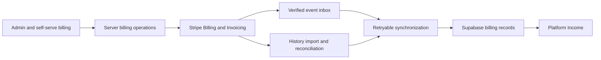

# Platform Income architecture proposal

Status: proposal, 28 September 2026. Based on the current repository and official Stripe documentation. No billing changes, invoices, customer communications, or charges have been made. Live Stripe configuration and deployed database state have not been audited in this planning exercise.

## 1. Decision

Add **Platform income** beside **Platform spend** under the existing admin **Payments** navigation. It is the operating workspace for money paid to Cliste: self-serve subscriptions, managed client contracts, setup charges, and other agreed services.

Use Stripe Billing and Invoicing for customer billing, invoice documents, payment collection, recurring schedules, and recovery. Use Supabase for a synchronized, queryable billing history, internal customer/location context, and an audit trail. Keep financial operations in the existing Next.js application; a separate billing microservice is unnecessary initially.

The workspace should answer: what was collected, what is outstanding, what will be billed next, and what needs intervention.

## 2. What exists today

| Existing component | Implication for this work |
| --- | --- |
| `src/app/(admin)/admin-payments-nav.tsx` contains only Platform spend | Payments is a navigation group, not an existing income ledger. Add a sibling route and keep subviews inside it. |
| `supabase/migrations/058_accounts_and_locations.sql` establishes accounts as the billing/team boundary and organizations as locations | Bill the paying account, and identify relevant stores on invoice/subscription lines. |
| Account fields hold one Stripe customer and one subscription | Preserve compatibility, but introduce a proper mapping and subscriptions table before supporting several agreements. |
| Self-serve checkout already creates plan, usage, and optional setup items | Reuse its prices, usage integration, customer portal, and shared Stripe client. |
| Managed plans currently describe direct/off-platform invoicing; retail billing is hidden by niche | Replace billing assumptions based on industry or onboarding source with explicit commercial settings. Add a common billing summary to managed retail details too. |
| Webhook handles checkout, subscriptions, and setup intents only | Add invoice, payment, adjustment, and settlement synchronization. |
| Platform Spend combines configured vendor costs with usage estimates | A future comparison can show an estimated operating contribution, but cannot honestly be labelled actual profit. |

Specific foundations to correct:

- `src/app/api/stripe/webhook/route.ts:69`: an event is marked seen before its handler succeeds. A failed handler returns an error, but replay is discarded as a duplicate. Replace this with received/processing/completed/failed states and replayable processing.
- The same route at lines 204 and 263 assumes any subscription is the account's sole subscription; cancellation can disable every location. Explicitly identify contracts that govern service access.
- At line 215, a healthy subscription can clear any suspension. Preserve manual/operational holds independently of payment recovery.
- `src/lib/account-billing.ts:24` ignores database update errors across several writes. Billing updates need checked errors and transactional local changes where applicable.
- `src/lib/platform-billing-elements.ts:229` creates a new customer and subscription without durable request idempotency. Consolidate customer reuse and operation IDs across checkout and admin billing.
- `src/lib/usage-sync.ts` and `src/lib/sms-usage-sync.ts` handle unlinked customers differently. Set a precise billing start and usage cutover before linking an existing pilot to Stripe.

## 3. Navigation and product surfaces

Entry route: `/admin/payments/platform-income`.

Keep four primary views, with client billing accessible from existing Customers and from rows in each view. Avoid maintaining a second customer directory.

| View | Main content | Actions |
| --- | --- | --- |
| Overview | Collected, outstanding, overdue, recurring monthly value; recent receipts; upcoming billing; attention queue | Create invoice; set up recurring billing; open an item needing attention |
| Payments | Successful receipts, processing payments, failed attempts, refunds, disputes; client and invoice links | Open payment/receipt; inspect failure; open related invoice; eligible recovery/refund actions |
| Invoices | Draft, open, paid, void and uncollectible invoices; overdue and partial-payment indicators | Draft/preview/send, resend, copy payment link, download PDF, void/credit or record a verified external payment |
| Recurring billing | Self-serve and custom agreements, amounts, frequency, collection method, service coverage, next invoice, cancellation dates | Create arrangement; preview/change future terms; schedule cancellation; manage payment method |

Use live account/location data for filters. Support date range, managed/self-serve source, account, location where allocated, status, and currency. Keep test mode visibly separate and exclude internal test data from production totals. Customer/account names, invoice number, and payment references should be searchable.

Payments may show all attempts for investigation, but the default collected-money view must contain successful receipts once each. Show a payment's attempt history in its detail rather than presenting repeated attempts as repeated income.

Each admin customer detail should show the account's billing contact, collection method, outstanding balance, next billing date, and links/actions scoped to that payer. Where several stores share an account, label that clearly.

### Attention queue

Prioritize overdue balances, failed automatic payments, customer authentication required, missing payment method, invoice finalization failures, disputed payments and refund failures. Include next scheduled retry, last reminder, outstanding amount, and the applicable action.

Also include unmatched Stripe customers/payments, failed synchronization jobs, and stale data. A billing problem and a synchronization problem need different messages. Do not show an error as an empty list or zero balance.

### Billing profile

Capture legal payer name, billing contact/email, billing address, tax identifiers/tax treatment, currency, default payment terms, PO/reference requirements, and relevant locations. Billing recipients need not be the store manager or the person with a login.

Separate three choices: managed versus self-serve relationship; one-off versus recurring charge; emailed invoice versus automatic collection. Neither industry niche nor signup source should determine the payment method.

## 4. Kavanaghs workflow

This is a proposed workflow, not an assumption that commercial terms are agreed. Existing sales material describes a pilot; keep an unbilled pilot supported without creating collectible invoices.

1. Open the existing client and choose its real legal payer. Confirm whether the store or head office pays; do not infer legal identity from the store name.
2. Add billing contact, address, currency, tax treatment, PO/reference, and agreed terms.
3. If agreed, create a one-off setup/service invoice, associate its lines with the relevant store, and preview the exact recipient and totals.
4. Set a recurring monthly agreement with the agreed start date and payment window. Proposed default for custom clients: email an invoice each period. No amount or due-date policy is assumed until entered.
5. Stripe generates each recurring invoice; configured invoice emails provide the hosted payment page and PDF. The admin sees outstanding amounts and reminders.
6. If the client later authorizes automatic collection, collect a supported reusable payment method through Stripe and change future billing accordingly.
7. Additional stores can appear as itemized services under one payer when the commercial arrangement calls for consolidated billing. Use separate agreements where start dates, payment terms, or legal payers differ.

Stripe supports recurring subscriptions using either `send_invoice` or `charge_automatically`. Recurrence and automatic charging are separate settings. See [Stripe collection methods](https://docs.stripe.com/billing/collection-method).

## 5. Invoice and recurring workflows

### One-off invoice

Choose payer → add service lines/quantities/periods/location attribution → set collection method, currency, terms, tax and reference → save draft → preview → finalize and send.

The preview must show the actual recipient, payable total, payment due date, and any automatic-charge consequence. An automatic-charge invoice uses a clearly labelled charge action, not a misleading Send button. In-app confirmations are part of these financial workflows.

Drafts are editable. Once finalized, use Stripe-supported revisions, voiding or credit notes as appropriate; do not silently rewrite issued financial documents. Preserve historical line descriptions, tax details and payer snapshots.

Use Stripe as the initial owner of invoice delivery and reminders. Explicitly test sending and email settings; finalizing alone is not sufficient proof of email delivery. Record send requested/succeeded/failed without claiming delivered or opened unless a provider signal supports that. Avoid duplicate reminder schedules in the app or Resend. See [invoice transitions](https://docs.stripe.com/invoicing/integration/workflow-transitions).

### Recurring agreement

Capture fixed items, quantity, billing interval, start/billing anchor, collection method, payment terms, and contract/service coverage. Reuse supported existing usage billing where agreed. Distinguish a one-off setup charge from the recurring amount.

Usage currently resolves through the Stripe customer. Require one active billing owner per account, meter and effective period unless usage is deliberately partitioned with distinct supported metering dimensions. Adding a second agreement must not bill the same call/SMS stream twice. At pilot cutover, record the paid effective start and classify earlier usage explicitly as waived, already settled, or separately agreed for billing.

Show the upcoming invoice estimate and mark variable usage as an estimate. Preview effective dates and proration before changes. Default commercial price changes to the next billing period unless an administrator explicitly chooses a supported immediate change.

Use Stripe subscriptions and schedules for recurring generation rather than an application cron that creates a new invoice each month. Initially support the actual needed monthly/annual arrangements; expose complex schedules only when implemented.

Do not expose a generic Pause button until it specifies whether invoicing stops, collection stops, service stops, or the agreement resumes on a certain date.

### Recovery and adjustments

Use Stripe retries for eligible automatic payments and reminder rules for emailed invoices. Show authentication/update-payment-method links through supported Stripe flows. Manual retry must check that payment has not already completed or started processing.

Refunds return money; credit notes adjust an invoice; voiding cancels an eligible invoice; write-off marks a debt uncollectible. These are distinct actions with separate authorization, reasons and audit entries. A credit note connected to a refund must not reduce reported cash twice.

If a client pays outside Stripe, record the verified amount, currency, received date, bank/reference, actor and source. Synchronize settlement through the supported Stripe mechanism. Label it an external payment and exclude it from Stripe payout/fee totals. Do not let a generic Mark paid button fabricate a Stripe receipt. Model partial allocations even if advanced partial-payment controls come later; see [Invoice Payments](https://docs.stripe.com/api/invoice-payment).

## 6. Data ownership and model

Stripe owns payment outcomes, issued invoices, subscription billing state, and balance transactions. The app owns account/location linkage, agreed service coverage, admin permissions, audit records, and service-access policy. Supabase stores the projection used by lists and totals, refreshed from Stripe events and reconciliation. Critical writes recheck current Stripe state before acting.

Suggested tables, grouped by purpose (exact migration names can be finalized during implementation):

| Records | Responsibility |
| --- | --- |
| `billing_profiles` | Payer details linked to the existing account; launch with one default payer per account, without imposing a schema that forbids future separate legal payers |
| `billing_stripe_customers` | Stripe account + live/test mode + Customer ID mapping; canonical active customer and explicitly mapped historical aliases |
| `billing_subscriptions`, items and service coverage | Multiple recurring agreements, collection method, current state, future changes, location allocation, and whether the agreement affects service access |
| `billing_invoices`, `billing_invoice_lines` | Stripe state, totals, amount remaining, tax/discount, due dates, issued line snapshots, hosted link/PDF reference |
| `billing_payments`, `billing_payment_attempts`, `billing_invoice_payments` | Canonical receipts, attempt outcomes and payment-to-invoice allocations; support partial and external settlements |
| Refunds, credit notes and disputes | Distinct adjustment records linked to underlying payment/invoice and settlement entries |
| Balance transactions and payouts | Gross/fee/net, availability and bank settlement references; introduced with reconciliation features |
| `stripe_webhook_events`, sync runs | Durable receipt, processing status, attempts, errors, lease/retry information, history import cursors and completeness |
| `billing_operations`, `billing_audit_log` | Persistent command ID, actor, request/version, Stripe IDs, outcome and sensitive-action history |

Use integer minor units plus currency, never floating-point money. Preserve UTC timestamps and display dates/reporting boundaries consistently in Europe/Dublin. Do not add EUR and non-EUR amounts together without an explicit, sourced conversion policy; initially report currencies separately.

Enforce uniqueness on Stripe account, live/test mode and external object ID. Where relevant, record sandbox identity too. Do not automatically merge customers by email. Imported unmatched platform receipts remain visible and counted in eligible platform totals, with their customer allocation flagged for review.

Each subscription item or invoice line can identify a location; multi-store payments stay one receipt. Store-level income requires a defined allocation. Keep unallocated lines visible rather than assigning the whole invoice to each store.

Financial history must survive store archival/deletion. Prefer restrictive deletion or retained snapshots over cascading away invoices and receipts. Bound retention of raw webhook payloads and restrict access to billing contact data; do not store card data, client secrets, or API secrets in logs.

Keep existing account customer/subscription fields as compatibility pointers during migration. The subscription pointer should reference an explicitly chosen core agreement, never whichever event happened last.

## 7. Reliable synchronization and operations

1. Verify Stripe signatures against the raw request body.
2. Insert the event into a durable inbox with a unique event identity. If persistence fails, return failure so Stripe retries.
3. Acknowledge only after durable receipt. A duplicate is safe to acknowledge because the original pending/failed event remains available to the processor.
4. Process with a database lease and bounded attempts. Commit local projection changes transactionally where needed, then mark complete. Retain failures with retry time and an operator replay action.
5. Events may be repeated or out of order. Retrieve current Stripe objects for mutable snapshots, serialize conflicting updates, and use idempotent upserts. Event timestamps alone are not an ordering guarantee.
6. Run a frequent bounded drain for pending/failed events. An immediate best-effort processing trigger may improve freshness, but the durable scheduled drain is the recovery guarantee. Never rely only on a fire-and-forget task.
7. Backfill historical objects with pagination and checkpoints. Reconcile open invoices, active subscriptions, recent payments and adjustments regularly, including changes made directly in Stripe. Revisit older unresolved objects and support a full resync.
8. Show last successful sync, coverage, lag, and failed-job count. Targets for the first release: normal event visibility within approximately one minute, periodic reconciliation, and visible warning on sustained lag; validate against deployment limits.

Stripe documents duplicate delivery and non-guaranteed ordering in its [webhook guide](https://docs.stripe.com/webhooks).

Extend coverage to invoice lifecycle/finalization failures, payment successes/failures/authentication, subscription lifecycle, refunds, credits, disputes and payouts when those views ship. Verify supported fields and event names against the repository's pinned Stripe API (`2026-03-25.dahlia`) and installed SDK, rather than mixing in newer preview behavior from current docs.

For writes, persist an operation and stable idempotency key before calling Stripe. Use separate stable keys per step (create/finalize/send). Resume an interrupted operation from its stored Stripe object ID. If Stripe succeeds but the database write fails, reconcile/retry that operation instead of creating a second invoice. Do not rely on Stripe's finite idempotency window as permanent deduplication. Changed draft inputs get a new version and appropriate new operation.

No distributed transaction exists across Stripe and the database. Make intermediate states visible, such as invoice created but send failed, and allow a safe retry of only the unfinished step.

## 8. Financial definitions

| Metric | Definition |
| --- | --- |
| Collected through Stripe | Successful captured/settled platform customer receipts in the selected period, counted once; label as including tax |
| Recorded external collections | Verified receipts outside Stripe, displayed separately and optionally included in a clearly labelled combined total |
| Refunded | Completed cash refunds in the period; pending/failed refunds are statuses, not completed cash outflow |
| Net collected | Collected minus completed refunds on the stated basis; keep disputes/adjustments and fees explicitly separate |
| Outstanding now | Current remaining collectible balance on open invoices; exclude drafts, void invoices and written-off amounts. Independent of the collection date filter. |
| Overdue | The outstanding subset past its payment due date; do not add it to outstanding again |
| Recurring monthly value | Fixed committed recurring charges normalized monthly, excluding tax, setup fees and variable usage; account for discounts and show overdue recurring value at risk separately |
| Stripe fees and net settlement | Source from balance transactions, including relevant refund/dispute/fee adjustments; label settlement timing and currency |
| Paid out to bank | Stripe payouts; a transfer of previously collected funds, never new income |

Invoice status paid does not establish cash receipt: credit balances, credits, zero-value invoices and external settlements can close an invoice. Invoice, PaymentIntent, Charge and InvoicePayment records can describe the same money. Link them; never sum all of them.

Stripe's [credit-note documentation](https://docs.stripe.com/invoicing/dashboard/credit-notes) explains invoice adjustments, and its [balance transaction reference](https://docs.stripe.com/api/balance_transactions/object) provides settlement amount/fee/net fields.

Show receipt date for collection reports, due date for debt aging, service period for invoice context, and payout arrival separately. Outstanding is a point-in-time balance, not simply invoices created within the selected collection period. Launch with Outstanding now and current aging. Historical as-of balances require retained invoice transitions, allocation/adjustment history or reconciled snapshots; do not reconstruct them from mutable latest-state records alone. Display period and basis next to every metric.

Scope platform income to Cliste's own services. The current shared Stripe client says Connect booking flows were removed, but legacy Connect fields remain in migrations. Inventory historical Stripe activity during import. Store gross sales, connected-account transfers and payouts are not Cliste sales. Only separately identified earned platform fees would be included if that business model returns. Do not infer ownership solely because a charge exists on the platform Stripe account; see [Connect charge/transfer behavior](https://docs.stripe.com/connect/separate-charges-and-transfers).

An income-minus-Platform-Spend comparison is an estimate because current spend includes configured run rates and usage snapshots. Defer accounting profit, revenue recognition and bank-account reconciliation until there is a suitable accounting integration and agreed definitions.

## 9. Service access, permissions and communications

Keep billing state separate from service state. A managed client may legitimately use service while an invoice is within agreed payment terms. Failed attempt, overdue invoice and suspension are different states.

Define contract-specific grace periods and explicit authority to suspend/reactivate. Start managed clients with manual service decisions unless an agreed rule exists. A setup invoice or supplemental subscription must not disable the account; recovery must not clear an unrelated manual hold.

Recheck platform-admin authorization and MFA in every financial mutation. A store account administrator is not a platform finance administrator. Initially use the existing platform admin boundary; introduce read/manage/refund capabilities when additional finance roles need them. Use server-only Stripe credentials and narrowly exposed database access. Apply RLS/revoked grants to finance tables and protect report views; see [Supabase RLS](https://supabase.com/docs/guides/database/postgres/row-level-security).

Keep customer payment methods and hosted portal sessions account-scoped. Managed client portal configuration should only permit agreed actions, such as payment-method updates and invoice history, rather than letting a bespoke contract accidentally change through self-serve plan controls.

Record actor, action, affected payer/object, old/new terms or amount, reason, operation ID and outcome. Provide review/confirmation for invoice send, automatic charging, refund, credit and cancellation. No approval bureaucracy is needed for ordinary viewing or editing an unsent draft.

## 10. Implementation sequence and release gates

### Phase 1 — Trustworthy income visibility

Repair the webhook inbox and checked persistence; introduce customer mapping and core billing projections; make existing checkout reuse/idempotency safe. Import existing live history, quarantine test activity, and implement Overview, Payments and read-only Invoices. Include refunds/credit adjustments in the model and totals from the start even if actions remain in Stripe initially. Add attention and sync status, client links and filtered CSV export.

Gate: totals reconcile to a documented Stripe period and currency; duplicate/replayed events do not double count; history coverage and unmatched records are visible. Direct Stripe changes appear in the app. Unavailable data never masquerades as zero.

### Phase 2 — Complete custom-client billing

Add payer setup, draft/preview/finalize/send invoices, hosted link/PDF, resend, monthly/annual recurring emailed invoices, configured reminders, and account detail billing summaries. Introduce explicit billing policy and core/supplemental service coverage before enabling new subscriptions. Provide a deliberate migration/cutover for pilot usage; no retroactive charges by accident.

Gate: a test customer completes one-off invoicing and recurring emailed invoicing end to end; retried commands create one invoice; recipient, due date, partial/remaining balance and next billing date are correct. Cancelling a supplementary agreement preserves other services. This is the first complete release for the requested custom-client use case.

### Phase 3 — Collection control and settlement

Add safe automatic-collection setup for custom clients, recovery actions, future-term changes with proration previews, in-app refunds/credits/write-offs, verified external-payment recording, detailed fee/payout reconciliation, and accountant-friendly exports. Read-only visibility of such financial events remains required earlier.

Gate: refunds/credits are not counted twice; external receipts are excluded from Stripe settlement; payment authentication and delayed methods behave correctly; reconciliation exposes unexplained differences.

Defer quote/e-signature workflows, a general accounting ledger, arbitrary contract builders, advanced forecasting, and complex multi-entity consolidation. Add no inactive controls or sample financial rows to the product. Every shipped action must be wired through authorization, Stripe, synchronization and visible outcome.

## 11. Focused acceptance scenarios

- Existing SaaS signup and renewal appear once with correct account and invoice; repeated checkout requests reuse the intended operation.
- A managed pilot can remain unbilled; linking Stripe does not silently invoice old call/SMS usage.
- One payer with two locations receives one properly itemized invoice, not duplicate income per location.
- Multiple recurring agreements cannot bill the same usage stream twice; usage before the agreed paid start is handled explicitly.
- Draft send double-click, Stripe timeout, database outage after Stripe success, and webhook replay all recover without duplicate charges/documents.
- Out-of-order subscription/invoice events converge to current Stripe state.
- Failed card payment, required authentication, processing payment, overdue emailed invoice and missing payment method produce distinct actionable states.
- A partial receipt reduces outstanding by its allocation; credit settlement does not invent cash; external settlement records its source and actor.
- Refund plus credit note changes cash once; disputes and payout adjustments retain traceability.
- Cancelling an add-on or paying an old invoice cannot wrongly disable/re-enable the whole account or clear a manual hold.
- A normal store user, anonymous user and unverified admin cannot invoke platform finance operations or read another payer's details.
- Test/live, multiple currencies, reporting-timezone boundaries, customer archival, missing mappings and stale synchronization remain explicit.

## 12. Business settings to establish during setup

Recommended custom-client default is recurring emailed invoices, with automatic collection available when agreed. The optional preference question in the planning conversation does not block the architecture because both use the same model.

Before a real client's first invoice, enter its actual legal payer/contact, negotiated prices, billing start, tax treatment, PO requirements and payment terms. Confirm the treatment of setup fees, included usage/overages, payment reminders and service grace periods. Check actual Stripe account payment-method, tax, email, portal and environment configuration in test mode before enabling live actions. These are setup decisions, not reasons to invent defaults or charge the pilot.
